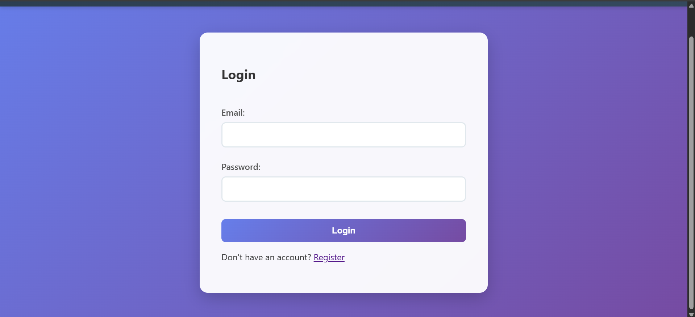
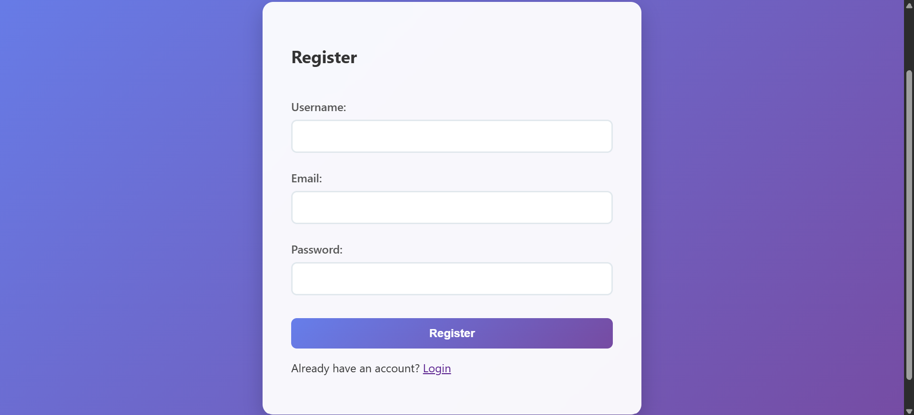
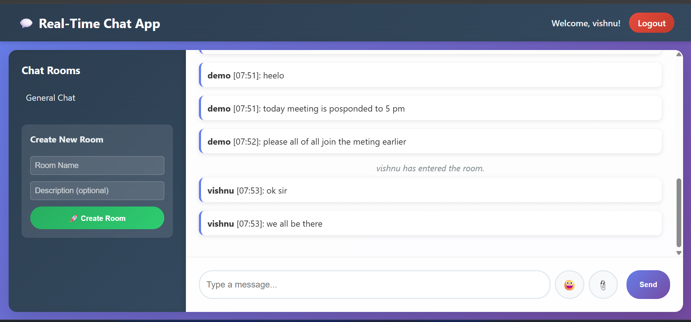

# 💬 Advanced Chat Application

An advanced real-time **Chat Application** built with Python (Flask, Socket.IO) that supports:
- User authentication
- Multiple chat rooms
- End-to-end encryption
- Multimedia sharing
- Message history
- Notifications & Emojis

---

## 🚀 Features
- 🔑 **User Authentication** (Register/Login system)
- 💬 **Multiple Chat Rooms**
- 🔒 **End-to-End Encryption** for secure messaging
- 🖼️ **Multimedia Sharing** (images, files)
- 📜 **Message History**
- 🔔 **Real-Time Notifications**
- 😀 **Emoji Support**

---

## 🛠️ Tech Stack
- **Backend:** Flask, Flask-SocketIO, SQLite
- **Frontend:** HTML, CSS, JavaScript
- **Other:** Encryption with Python cryptography

---

## 📦 Installation

1. Clone the repository:
   ```bash
   git clone https://github.com/YourUsername/OIBSIP_Python_Programming_Task5.git
   cd OIBSIP_Python_Programming_Task5
   ```

2. Create a virtual environment:
   ```bash
   python -m venv venv
   source venv/bin/activate   # On Linux/Mac
   venv\Scripts\activate      # On Windows
   ```

3. Install dependencies:
   ```bash
   pip install -r requirements.txt
   ```

4. Run the app:
   ```bash
   python app.py
   ```

5. Open in browser:
   ```
   http://127.0.0.1:5000/
   ```

---

## 🎥 Demo Video

[](https://youtu.be/your-demo-video-link)

*(Click the image above to watch the demo video)*

---

## 📸 Screenshots

### 🔑 Login Page


### 📝 Register Page


### 💬 Chat Room


---

## 📂 Project Structure
```
OIBSIP_Python_Programming_Task5
│── app.py              # Main Flask app
│── auth.py             # Authentication logic
│── encryption.py       # Encryption utilities
│── sockets.py          # Socket communication
│── models.py           # Database models
│── requirements.txt    # Dependencies
│── templates/          # HTML templates
│── static/             # CSS/JS files
│── instance/chat.db    # SQLite database
│── screenshots/        # Project screenshots
```

---

## 👨‍💻 Author
Developed by **Vishnu Kumar**

- 📧 Email: vishnu241206@gmail.com  
- 📞 Phone: 9500906427  
- 🌐 GitHub: [VishnuKumarLH](https://github.com/VishnuKumarLH)

---

⭐ If you like this project, don't forget to **star the repo**!
